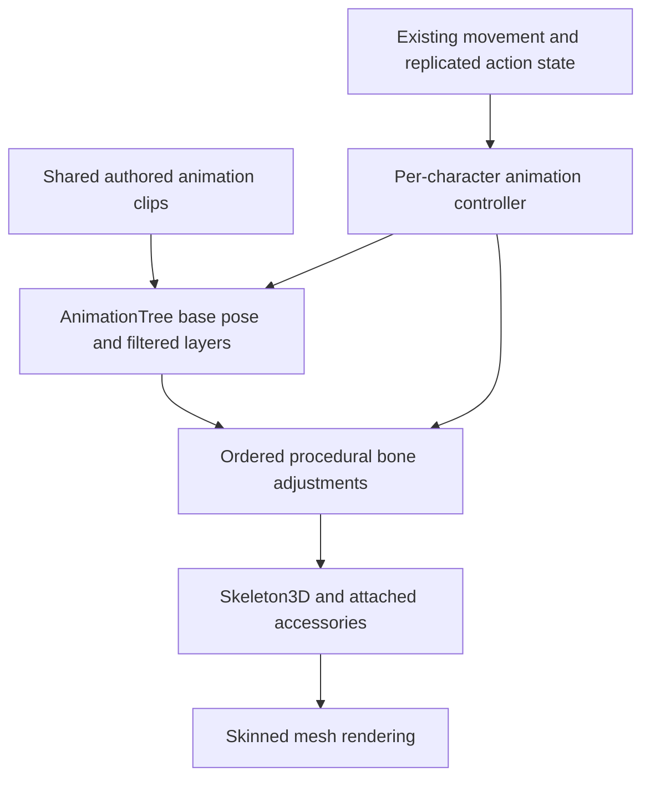

# Character animation architecture

Use authored clips for repeatable movement, blend them with Godot's
`AnimationTree`, and apply procedural adjustments only where the character must
respond to its surroundings. Evaluate the base pose once per animation update;
apply overlays to the bones they affect without repeatedly reapplying the whole
body.

This is the recommended direction for Casino Royale, not a claim that every
animation has already migrated or that one technique is fastest for every scene.
Measure the existing procedural implementation and the replacement on the actual
native and web clients before adopting a migration.

Related context: [gameplay](design/gameplay.md), [architecture](architecture.md),
[player models](../game/features/player_models/README.md),
[casino patrons](../game/features/casino_patrons/README.md), and
[frame profiler](../game/features/profiler/README.md).

## What profiling established

During the October 2, 2026 animation bisection, disabling patron animations had
the largest reported effect on frame time. Disabling finger curls had little
noticeable effect on the graph. Disabling the main `SkinnedHuman.pose()` bone
pass produced a large improvement while surrounding animation calculations and
rig transforms continued.

These observations implicate the main pose pass and the engine work it triggers.
They do not establish how much time belongs to GDScript calculations, native
skeleton processing, rendering submission, or GPU work. The measurements were
rough comparisons; no precise percentage or millisecond saving is established.

The inspected profiling baseline had several avoidable costs:

| Pattern | Cost and intended replacement |
| --- | --- |
| Animate `Node3D` pivots, then translate their rotations into skeleton bones | Maintain two pose representations and propagate node transforms. Animate bone tracks directly, or calculate procedural poses in data. |
| Apply avatar bones, adjust an NPC pose, then apply the bones again | Calculate and write an intermediate pose that is overwritten. Apply NPC adjustments before committing the base pose. |
| Recalculate fixed rest bases and parent inverses during every pose pass | Repeat setup mathematics. Cache immutable rig information when the skeleton loads. |
| Write unchanged bone values | Mark pose data dirty unnecessarily. Skip redundant writes in the custom procedural path. |
| Initialize every guest's 100 ms update timer together | Concentrate updates into the same frames. Stagger update deadlines independently of visual animation phase. |

These describe the baseline that motivated the investigation. Check the current
code before assuming any individual cost remains: incremental optimizations can
land before the broader architecture changes.

Godot's skeleton setters mark pose data dirty and schedule engine updates.
Deferred updates can be combined, so two script pose passes do not necessarily
cause two complete rendering updates. Removing redundant script work still
helps, but its effect on total frame time must be measured separately.
See the [Skeleton3D implementation](https://github.com/godotengine/godot/blob/master/scene/3d/skeleton_3d.cpp).

## Recommended animation pipeline

The controller chooses states and supplies parameters such as local movement
direction, speed, look direction, seated state and action weights. The existing
movement controller continues to move the player; locomotion clips should be
in-place so animation does not introduce a second movement authority.

Use animation resources through `AnimationPlayer` and `AnimationTree` for
repeatable motion. Let `AnimationTree` control playback when it is active;
avoid independently advancing another player over the same bone tracks. A simple
NPC with one loop may need only `AnimationPlayer`; a large blend graph is useful
only when the character needs its transitions and layers.

Godot provides state machines, blend spaces and track filters for this purpose.
See [Using AnimationTree](https://docs.godotengine.org/en/stable/tutorials/animation/animation_tree.html).

| Motion | Recommended implementation |
| --- | --- |
| Idle, walk, run, jump, landing, crouch and sitting | Shared clips with the state transitions and directional blending the existing behavior requires |
| Repeatable emotes and dealing motions | Clips or filtered action layers, with existing action timing preserved |
| Looking at a player or aiming toward a changing target | A procedural adjustment affecting the relevant head, torso or arm bones |
| Hands gripping different items, table edges or wheelchair handles | Procedural arm IK and grip adjustments after the base pose |
| Finger grips | Reusable grip poses or targeted procedural curls when the grip changes |
| Ties, hats and other accessories | Bone attachments or a small set of necessary anchors following the final pose |

Choose an explicit order for procedural adjustments and define which action owns
each affected bone. Preserve current held-item, emote and gesture priorities.
Use `SkeletonModifier3D` for adjustments that need to run after animation
evaluation; read the final pose after the relevant modifier has completed rather
than relying on incidental script processing order. Godot describes this lifecycle
in [Design of the Skeleton Modifier 3D](https://godotengine.org/article/design-of-the-skeleton-modifier-3d/).

The goal is one coordinated base evaluation followed by necessary overlays.
Modifiers can legitimately change bones written by the base animation; the waste
to remove is repeated full-body evaluation and application for each small change.
Native clip playback still incurs blending, skeleton updates and skinning costs.

## Efficient procedural animation during migration

Procedural animation remains appropriate for this game's responsive and unusual
character behavior. It can also preserve the current look while reducing overhead:

1. Resolve bone indices and cache rest transforms, parent rest inverses and fixed
   local axes when the rig loads. Rebuild caches if the skeleton or its rest data
   changes.
2. Calculate locomotion and NPC adjustments in typed pose data, then commit the
   final base pose. Avoid a complete skeleton pass between those calculations.
3. Write only values that changed. Any comparison must account for IK and emote
   modifications; an old private cache of the base pose alone is insufficient.
4. Keep dynamic target calculations dynamic. Current bone poses and world-space
   targets used by IK cannot be treated as immutable rest data.
5. Retain only the scene pivots needed by existing accessories or integrations.
   Migrate their callers before removing paths used by held items or creature
   variants.

Existing motion can be baked into animation resources using the repository's
native tooling, or authored in the existing model workflow. Bake the final motion
that should repeat; keep changing item targets and interaction constraints
procedural. Reuse clips and mesh resources across characters while keeping
playback state, material appearance and action weights per instance.

## Crowd updates

Keep nearby players and visible interactions responsive. Introduce lower animation
update rates for distant background NPCs only after measuring the first optimizations.
Use distance and visibility to select an animation update rate independently of
NPC routing, collisions, gameplay and networking.

Stagger deadlines so background characters do not all update together. Advance
animation by accumulated elapsed time when an update is due. If manually advancing
an animation system, disable its automatic advancement to avoid evaluating twice.
When resuming a hidden character, restore the current animation phase rather than
replaying every missed update.

Rendering visibility does not automatically prove it is safe to stop posing:
shadows, attachments and gameplay queries can depend on the skeleton. Establish
those dependencies before suspending updates. Rate thresholds and character
budgets should come from measurements on representative clients.

## Migration and acceptance

Start with cached setup data, skipped unchanged writes and removal of intermediate
NPC pose passes. Then migrate one ordinary patron's idle and walk behavior to
clips, compare it with the procedural baseline, and expand only after the result
preserves behavior and improves the relevant frame-time measurements. Add sitting,
named patrons, guests, player locomotion and layered actions incrementally.

Keep cosmetic animation driven by existing replicated movement and action state.
Do not replicate every bone or change player movement authority to support the
animation system. Preserve server-owned action validation and late-join timing.

For each comparison:

- Use the same checkout, camera position and angle, NPC count, graphics settings,
  renderer, frame cap and profiler settings. Close diagnostic menus and warm up
  before recording equal-length samples.
- Record total frame-time median and upper percentiles, missed-budget frames,
  Process Time and Script Functions time. Compare variability as well as averages.
- Use temporary animation switches to isolate work, then validate with all normal
  animations enabled. Frozen characters are a diagnostic baseline, not an equivalent
  production result.
- Treat script CPU benchmarks as evidence about pose calculations. Headless runs
  cannot establish graphical-client skinning or rendering savings, and wall-clock
  render landmarks do not identify GPU execution time.
- Review walking, sitting, flinching, knockout and recovery, named patron gestures,
  item grips, emotes, hats, creature variants and first/third-person transitions.
  Verify accessories and hands still follow the intended final pose.
- Run the required game checks for implementation changes, including offline and
  multiplayer smoke coverage. Validate representative native and web clients.

A migration is successful when it improves measured frame-time behavior while
preserving animation, movement and interaction behavior. Changing node types or
lowering Script Functions time alone does not establish that result.
