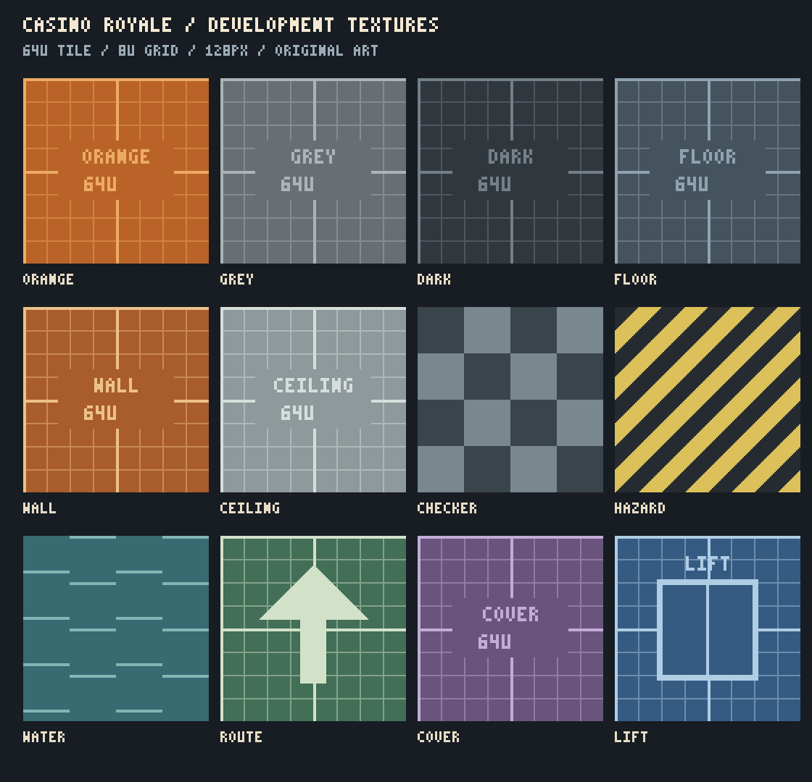

# Procedural rooms: gameplay-first generator

Status: the full generator is proposed; an independent socket attachment prototype
and a connected five-floor garage plus three standalone playable examples now exist. See
[the lab instructions](../../game/features/procedural_rooms/README.md) and
[rendered overview](previews/socket-examples/overview.png). The examples demonstrate
eight physical joins, ramps, stairs, sideways sewer connections, sliding doors and
distinct garage/utility/pump/storage sets. An exploded gallery shows the W03 mating
faces. Structural shells use indexed inward faces with a canonical vertex pool and
split boundaries instead of wall boxes. They do not
implement the general random layout solver or alter the live casino. The garage adds
47 physical joins, elevator cabs with instant validated floor transfers, and seeded
set-piece population rules. Designers specify allowed sets, weights, density, local
placement zones, rotations and reserved walking lanes. The same seed reproduces the
same arrangement; invalid, overlapping or forbidden placements are rejected. See the
[connected world screenshots](previews/world-level/world-overview.png).

Build a new `features/procedural_rooms/` generator around three-dimensional module
sockets and a gameplay route graph. Give designers seed, floor count, room budget,
route width, verticality, cover density and sightline controls. A good result should
be fast to traverse, easy to reproduce and worth playing before it receives artwork.

## Design boundaries

The Golden Crown remains the shared, combat-free social hub. Generate slum
destinations, reached voluntarily by elevator, with an immediate way back. Preserve
fast arena movement, flanking and readable vertical combat. No mandatory raid timer,
quest, extraction countdown or new lore explanation.

The garage preset must eventually provide at least five floors, top-floor arrival,
an open central shaft and descending risk/value. Sewers are a testable module family,
not a decision that the canonical garage has a basement. Enemy types, death penalty,
shaft fall damage, loot persistence and final exit rules remain TBD.

## What exists, and why build a new generator

Inspected the room compiler, material pipeline, room kits, sewer builder, garage
stairs, room streaming, slum registry, elevator state machine and their existing
tests/readmes. These are useful references for compatibility, not the generation
backend for this proposal.

| Existing system | Observed capability / limit |
| --- | --- |
| `world_builder/layout.gd`, `elevation.gd` | Seeded X/Z rooms and corridors, ramps and stairs; footprints cannot overlap at different heights. This cannot represent general stacked rooms or reserved shafts. |
| `room_kits/` | Architectural pieces and palettes; not a gameplay graph or 3D placement solver. |
| `sewer_kit/kit.gd` | Explicit six-metre grid network with ports and shafts; topology is supplied by the caller. |
| `parking_garage/` | Authored three-storey garage, arrival at the lower level. It differs from the intended five-storey, top-down, open-shaft garage. |
| `room_doors/StreamedRoom` | Loads local static content while anchors remain present. This alone does not provide private group instances or server collision for streamed contents. |
| `dev_elevator/SlumDestinations`, `elevator/` | Registered arrival points and server-controlled boarding/teleports; private generated destinations and group isolation are not implemented by the random picker. |

The new generator owns its module definitions, graph, spatial solver, mesh/collision
builder and validation. It should not depend on the hotel compiler, its blueprints,
its kits or its material theme. Keep the working player controller and existing
gameplay services as integration contracts; generation does not need movement changes.

## Module contract

Use typed Godot Resources for `ModuleDefinition`, `SocketDefinition` and
`GenerationProfile`, with a serialized resolved layout for debugging. All transforms
and clearances are metres. Initially allow translation plus yaw in 90-degree steps;
no mirroring or nonuniform scaling that silently changes movement/collision.

Each module declares:

- Stable ID/version, semantic tags and allowed zone/floor roles.
- Visual bounds, solid occupied volumes and reserved empty volumes. A ramp reserves
  space above its slope; a shaft reserves its whole vertical opening.
- Sockets: local floor position, outward normal, opening width/height, connection
  type, allowed partners, arrival landing and player clearance volume.
- Traversal edges between sockets, including direction and requirements. Walking,
  stairs, lifts, ladders and optional jumps are different edges.
- Cover/loot/encounter anchors and keep-clear areas. Anchors carry tags, not economy
  values or an invented enemy faction.
- A simple collision recipe and a replaceable visual scene. Art must not change
  socket transforms or traversal without revalidation.

Socket matching requires opposing normals, compatible types, matching elevation,
opening size and clear landings. Names or bounding-box proximity alone do not
establish a connection. End caps close every unused socket.

## Seamless socket attachments — required

Every connectable room/module scene owns explicit `SocketAttachment3D` child nodes.
An attachment is a physical boundary contract, not just a position marker. It uses
a shared `SocketProfile` resource to define the opening shape, floor edge, wall and
ceiling edges, structural thickness, collision boundary and reserved clearance.
The room shell is built around that attachment's opening, so the wall is already
cut correctly. Moving an attachment without rebuilding/validating its shell is invalid.

Define each attachment frame with its origin at the opening's floor centre, local
+Z pointing outward and local +Y pointing up for walking openings. A shaft uses an
explicit oriented frame and boundary profile. Profiles own ordered boundary vertices
and mating rules, including floor height and surface normals; an ID/width/height
match alone is insufficient. Rooms, corridor ends, ramp/stair landings, sewer ends
and elevator landings all use this same attachment contract.

Place a new module by solving from the chosen attachments:

```text
module_B_world = socket_A_world × mate_transform × inverse(socket_B_local)
```

For ordinary facing doorways, `mate_transform` is a 180° turn around the socket's
local Y axis with zero translation. This aligns the entire boundary frame, not
just the room centres. Use the profile's explicit mating transform for other
orientations. The resulting placement must respect the module's allowed rotations;
reject it if it does not. Do not round a solved transform back onto the layout grid.
During loop closure, match the already placed endpoints and backtrack if they fail
to align; do not move an existing room and break its previous connections.

Required join rules:

- **Flush geometry:** transformed floor, wall and ceiling boundary vertices coincide.
  No cracks, raised thresholds, doubled walls, exposed backfaces or protruding trim.
  Initial validation tolerance is 1 mm for vertices and 0.1° for orientation; these
  are numerical acceptance limits, not permission to leave physical gaps. Accepted
  boundary vertices are emitted from one canonical join frame.
- **One owned seam:** the assembler assigns a stable join ID and emits shared seam
  geometry/collision once. Remove both opening caps and any internal boundary faces;
  do not leave overlapping coplanar faces or colliders that can flicker or snag.
  Module solids meet at the boundary without overlapping interiors. Shared seam
  clearance is intentional; overlapping keep-clear volumes are allowed, solids are not.
- **Continuous movement:** flat attachment landings share floor height and support.
  Ramps/stairs transition to level socket landings inside their module; their sloped
  walking collider joins the landing without a lip or unsupported sliver. Validate
  the complete crossing corridor, including jumps and sideways approaches.
- **Compatible shape:** direct joins require the same mating boundary profile.
  Different widths, ceiling heights or sewer/room cross-sections need a dedicated
  transition module with its own matching sockets at each end. Never stretch rooms,
  conceal a gap with decorative trim or insert an unvalidated filler.
- **Continuous surfaces:** development grids use the same world-space scale/origin
  across a join. Future artwork uses a shared seam UV/material rule or an authored
  transition; no accidental texture-scale, normal or lighting discontinuity.
- **Complete attachments:** each socket is consumed once by a join or sealed by its
  profile's cap. A door is installed once in a valid joined opening; its frame and
  collision respect the passage clearance. Door state does not change socket alignment.
- **Lift safety:** stationary elevator landing attachments obey the same flush rules.
  The moving cab must align its floor at each served landing before doors open.
  Shaft barriers and door interlocks prevent passage while the cab is absent or moving;
  a static socket match alone cannot establish safe lift traversal.

The offline lab must include a socket-attachment inspector and a pairwise join
gallery. Test every allowed profile pair at all allowed rotations, including room
to room, room to corridor, ramp/stair landings, sewer transitions and lift landings.
Check transformed boundary vertices/normals, cap removal, seam ownership, continuous
collision and grid alignment. Run the actual player over the centre and both edges
in both directions, at walking/running speeds and while jumping/strafe-turning.
Save/reload and streamed re-entry must preserve the join and keep both sides' floor
collision available. Deliberately mismatched profiles, loop closures and blocked
landings must fail with socket IDs and measured errors.

Seamless attachment is a Step 1 acceptance gate before random layout generation.
The example kit implements rectangular profiles, exact mating transforms, cap
removal, canonical shared shell vertices, face/edge topology checks and clearance/
traversal tests. General profile adapters, arbitrary authored-mesh integration,
lift interlocks, streamed re-entry and the full
pairwise/profile test matrix remain required as the kit expands.

## First model kit to build

These are target gameplay dimensions. The current example kit supplies 8×8 m room
shells, a ramp, stairs and straight sewer connectors with simple meshes/colliders.
The remaining module variants below are planned; no polished props or baked lighting.

| Module family | First pieces and rules |
| --- | --- |
| Rooms | 8×8, 12×12 and 16×12 m shells; socket variants on each wall; optional upper gallery. |
| Routes | 3 m and 5 m wide straight, corner, T and cross pieces; widened corner landings. |
| Ramps | Straight/switchback variants with level landings; start at 10° maximum. A 4 m rise needs about 22.7 m horizontal run plus landings. |
| Stairs | Straight/switchback flights; visible steps with a continuous sloped walking collider, following the current controller's needs. Start with ≤0.18 m risers and ≥0.28 m treads. |
| Sewers | Straight, corner, T, cross, dry ledge, junction chamber and ladder access; routes stay wide enough for combat movement. Water starts as a visual plane. |
| Elevators | Cab shell, shaft, landing and two-door lobby; reserve shaft height and door sweep. An internal lift gets a parallel stair/ramp route. |
| Garage | Ring-floor quadrant, shaft-edge parapet, gallery bridge, ramp bay and stair core. No floor or roof may cap the central shaft. |
| Cover | Car-sized block, pillar, waist-height barrier, crate and dumpster silhouettes. Collision is deliberately simple. |

Initial shell clearance: 3.5 m; floor spacing: 4 m. Structural placement uses a 1 m
grid, sockets can use 0.25 m offsets, and connectors retain exact endpoint transforms.
The measurement texture's 64U repeat is a visual ruler, not the layout grid.
Current standing hull is 0.8128 m wide and 1.8288 m high; confirm runtime values in
validation rather than encoding these permanently. Provide clearance for jumping
and strafing, not merely enough space for a stationary capsule.

## Generation pipeline

1. **Build the gameplay graph.** Reserve arrival/return, main circuit, a second route,
   vertically connected fights and optional loot branches. Edges describe intended
   traversal; a lift or one-way drop never becomes the only mandatory connection.
   Garage graph: five rings around one reserved shaft, with at least two independent
   bidirectional ways between adjacent floors.
2. **Solve spatial placement.** Place shaft and stair/ramp cores first, then rooms and
   connectors. Solve exact attachment transforms in 3D, check solid/empty-volume conflicts and backtrack
   when an edge cannot fit. Reserve headroom, door swings and landings before props.
3. **Assemble the shell.** Build meshes, floors, colliders, end caps and markers from
   the resolved placements, using canonical shared boundaries for seamless joins.
   Keep collision independent of the presentation palette.
   Batch static visuals by material and spatial chunk, never into one giant map mesh.
4. **Validate actual traversal.** Capsule sweeps, floor-support/headroom checks and
   real-controller runs in both directions across every mandatory socket/connector.
   A connected abstract graph is insufficient. Navigation meshes serve AI later;
   they do not prove that a fast-moving player can use the routes.
5. **Place gameplay anchors and cover.** Use a separate seeded pass after structure
   passes validation. Preserve movement lanes, arrival clearance, ramp runouts and
   alternate routes. Reject cover that invalidates traversal. Vary sightlines and
   heights without filling every room with random clutter.
6. **Score and accept.** Measure travel distance, route alternatives, visibility,
   chokepoints and cover distribution. Save seed, versions, resolved layout and
   validation report. Reject impossible layouts instead of hiding errors with
   teleport links. Bound retries (initial proposal: 32); use a known validated
   fallback and report the reason if the budget is exhausted.

Split RNG streams for structure, cover and encounter anchors so moving one crate
does not reroll the entire map. Sort candidate/socket lists before selection, pin
generator and kit versions, and save the full resolved placement list. Freeze a
layout while occupied; the same group's elevator trip shares one zone and seed.

## Iteration workflow

First build an offline lab using the actual player controller: change seed/profile,
regenerate an empty lab, freeze a layout, toggle grid/plain materials, draw sockets,
reserved volumes and colliders, then export/import a layout. Show failed connection
IDs and concrete blocking geometry. Save promising seeds as regression fixtures.

Suggested initial profiles: `movement_lab`, `garage`, `sewer`, then `alley`. Tune
three to six rooms on two elevations before trying the complete five-floor garage.
Test running, jumping, strafe turns, ramp approach/departure, stair ascent/descent,
landing crowds and cover lanes with keyboard, controller and touch.

## Multiplayer and loading

Offline geometry generation can be delivered first. Proper group instances are a
separate Phase 1 prerequisite before presenting random private elevator excursions
as complete. Existing spatial offsets and camera clipping do not isolate combat,
loot, player replication or messages between groups.

For multiplayer, the server selects and validates the layout, then sends its
instance ID, kit/generator versions, seed, resolved placements and layout hash.
Clients assemble that description rather than making independent random choices.
Only ready clients with a matching hash may enter; load floor collision before
teleporting. Disconnect/error paths must leave players with a safe return option.

Separate static geometry, lightweight server collision, and persistent authoritative
entities. Interactive elevator/door/loot nodes must have stable instance-scoped
paths outside disposable visual chunks. Use existing validated interaction services
for gameplay actions. Replication, combat and loot requests need actual instance
membership checks, including late joins; global chat may remain global.

Start by loading one compact destination per client. Add chunk streaming only after
the full-zone baseline works: preload adjacent visible chunks and preserve collision
at crossings. The open garage shaft requires views and encounters across floors;
unloading everything outside the current room would break that experience. A server
retains collision and simulation for occupied instances. Unload an instance after
its last occupant leaves and a bounded cleanup grace period ends.

## Delivery order and acceptance

| Step | Deliverable | Gate |
| --- | --- | --- |
| 0 — this change | 12 original textures, Godot materials and this plan | Inspect artwork, load assets/materials, confirm measurement scale. |
| 1 | New module contracts, socket attachments, primitive kit and offline lab | Pairwise join gallery passes flush boundaries, single seam ownership, continuous collision and actual-player traversal before random generation. |
| 2 | Graph generator, 3D solver, validation and saved layouts | 100 fixed seeds reproduce placements; each passes required-route sweeps, floor support, prop clearance and save/reload. Bad input fails clearly. |
| 3 | Five-floor garage preset and sewer profile | Top arrival, open shaft, two adjacent-floor routes, optional depth, readable fights. Sewer return path works. |
| 4 | Group-instance integration and lifecycle | Two groups cannot see/damage/loot each other; four occupants share a layout; late join, rejected fifth occupant, return and disconnect cleanup work. |
| 5 | Playtest and art replacement | Movement/combat routes approved through play; replace visuals while preserving tested sockets and collision. |

Run repository verification before commits/PRs. Add focused tests for deterministic
placement, socket alignment, vertical overlap, bounded failures, collision and
instance authority as those systems are introduced. Profile browser/touch devices
and server memory with real generated maps before setting final chunk/geometry
budgets; prototype limits are controls, not claimed performance results.

## Developer texture pack



The original 128×128 PNGs live in `game/assets/procedural_rooms/dev_textures/`;
materials and the regeneration tool live in `game/features/procedural_rooms/`.
Orange/grey/dark are general surfaces; floor/wall/ceiling clarify geometry;
checker exposes stretching; hazard marks edges; water marks placeholder drainage;
route, cover and lift distinguish test roles. Colors and graphics are development
markings, not the final muted world-art direction or gameplay logic.

See the pack's README for world scale, UV orientation and regeneration.
